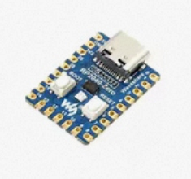
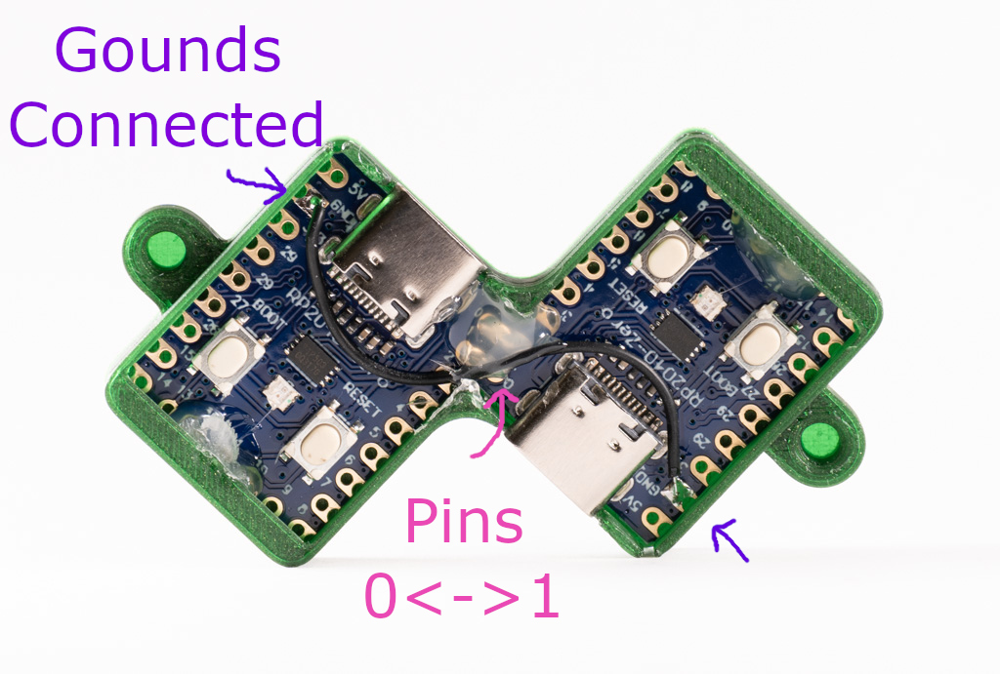
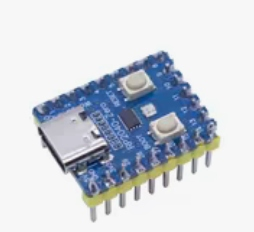
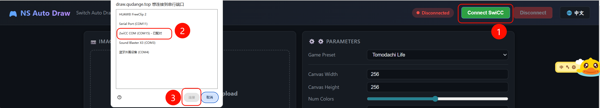
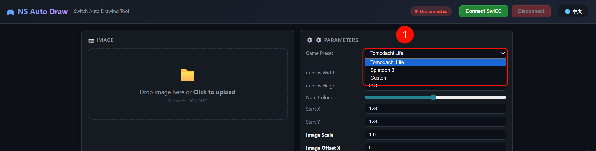
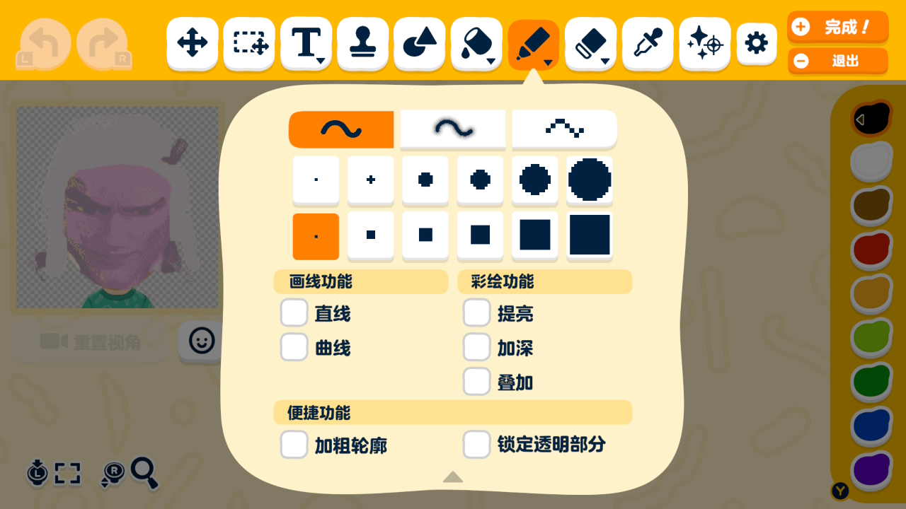
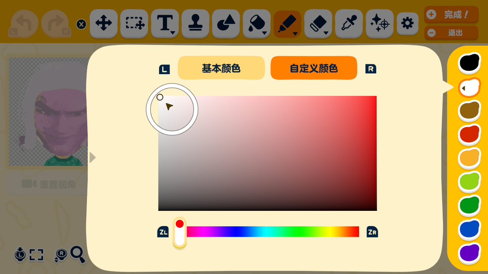
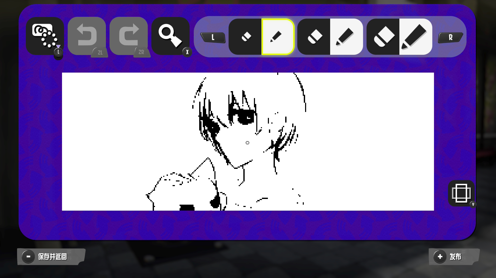

# Nintendo Switch Auto Draw

> [!NOTE]
> **Vibe Coding / AI-Assisted Disclosure**
> Please be aware that this project was heavily developed with the assistance of AI (Vibe Coding). The architecture, logic, and code generation were collaboratively built using an AI agent. 

A Web Serial API based automatic drawing tool for the Nintendo Switch. This tool runs directly in your browser without requiring any local client installations or complex Node.js environment setup.
Auto Draw converts images into commands that 2wiCC can recognize, and then simulates Nintendo Switch controller inputs to send drawing commands.

[👉 **中文文档请点击这里 (Chinese README)**](./docs/README_zh.md)

## 🌟 Features

- **Fully Automated Drawing**: Import an image, and the tool will automatically handle color quantization, dithering, and color extraction. It will auto-change colors in-game and perform smart snake-like scanning to fill the canvas.
- **Smart Pathfinding**: Utilizes a bounding-box algorithm to skip transparent and empty pixels, massively reducing the total drawing time.
- **Zero-Install Web App**: Connects directly to your microcontroller via USB using the Web Serial API. Just open the webpage and play.
- **Intuitive Editing Experience**: Move, scale, and erase the image at any time.

## 🚀 Tutorial (Zero Setup)

### Hardware Preparation

#### Option 1: Soldering

- Requirements:
   - RP2040-zero microcontroller (without pins) * 2 
   - (Optional) 3D printed case: https://www.printables.com/model/1401073-2wicc-case
   - Soldering iron/solder/wires, etc.
- Assembly:
   - Follow the [**2wiCC**](https://github.com/knflrpn/2wiCC) wiring guide to connect the two RP2040-zero boards: Board A Pin 0 to Board B Pin 1, Board A Pin 1 to Board B Pin 0, Board A GND to Board B GND. 
- Firmware flashing: Flash [2wiCC_Comms](https://github.com/knflrpn/2wiCC_Comms/releases) to Board A, and flash [2wiCC](https://github.com/knflrpn/2wiCC/releases) to Board B.

#### Option 2: No Soldering

- Requirements:
   - RP2040-zero microcontroller (with pre-soldered pins) * 2 
   - (Optional) 3D printed case: Work in progress
   - Breadboard and jumper wires

### Software Usage

- Visit the hosted page: [NS Auto Draw](https://draw.qudange.top/)
- Plug one end of the 2wiCC into your PC and the other end into your Nintendo Switch. Click "Connect" in Auto Draw. 
- Select the preset for your specific game in the top right corner. 
- Add the image you want to draw on the left side of the webpage.
- Adjust parameters using presets or customized values:
   - Canvas Width: The width of the drawing canvas in the game.
   - Canvas Height: The height of the drawing canvas in the game.
   - Colors: How many colors the uploaded image will be quantized to (e.g., Splatoon 3 is 1-bit monochrome, while Tomodachi Life is multi-color).
   - Start X: The default starting X position of the brush when entering the drawing board (usually the center, i.e., Width/2).
   - Start Y: The default starting Y position of the brush when entering the drawing board (usually the center, i.e., Height/2).
   - Image Scale: The scaling factor of the original image.
   - Image Offset X: The X-axis offset of the preview image on the canvas.
   - Image Offset Y: The Y-axis offset of the preview image on the canvas.
   - B&W Threshold (Monochrome): Controls the intensity of converting the original image into a monochrome preview.
   - Press Frames (pf): Controls how long a "button press" state is sent to the Switch (unit: frames, 1 frame ≈ 16.6ms). If this value is too small, the Switch may drop inputs; if it is too large, drawing will take significantly longer.
   - Release Frames (rf): Controls the "button release" waiting time between two button presses. Also prevents input dropping. If you notice missing dots, try slightly increasing pf and rf.
   - Dither Algorithm: Determines how transition colors are handled when the image colors are quantized (e.g., converting a color photo to black and white for Splatoon 3).
      - Floyd-Steinberg: Error diffusion algorithm. Uses dense noise dots to simulate gradients, preserving brightness and details. **Ideal for photos, gradients, and illustrations.**
      - None: Directly snaps pixels to the nearest available color without generating noise. Edges remain extremely sharp. **Ideal for line art, logos, text, and simple icons.**

### Special Instructions

#### 《Tomodachi Life》

1. Enter the face drawing interface, select the smallest square brush. 
2. Click the color palette on the right, switch to Custom Color, set the color pin to the top left corner, and the slider to the far left. 

#### 《Splatoon 3》

Select the smallest brush at the top.


## How to Deploy

### Using the Hosted Page

This project is hosted on Vercel. You can directly access and use it without deploying anything yourself: [NS Auto Draw](https://draw.qudange.top/)

### Self-Hosting

Since this project is a purely static frontend webpage, you can deploy it instantly using **GitHub Pages**:

1. Fork or clone this repository to your GitHub.
2. In your GitHub repository, go to `Settings` -> `Pages`.
3. Under `Source`, select `Deploy from a branch`.
4. Choose the `main` (or `master`) branch, select the `/(root)` folder, and click Save.
5. Wait a minute or two, and GitHub will generate your dedicated URL (e.g., `https://your-username.github.io/nintendo-switch-auto-draw/`).
6. **Open this URL to connect your microcontroller and start drawing! No downloads or environment setup required.**

> **Note**: Due to browser security restrictions, the Web Serial API can only be invoked in an HTTPS environment. Therefore, accessing it via GitHub Pages or Vercel is the easiest and best choice.

## 🛠 Local Development & Testing

If you wish to modify or develop locally:

1. Clone this project.
2. Double-clicking `index.html` directly via the `file:///` protocol will trigger CORS restrictions and the Web Serial API will be disabled.
3. Please start a local web server in the project root directory. For example:
   ```bash
   npx serve -l 3456
   ```
4. Access and debug via `http://localhost:3456`.

## 📁 Directory Structure

- `index.html` - Main drawing control panel
- `css/` - Stylesheets
- `js/` - Core logic modules (image processor, draw engine, serial manager)
- `tests/` - Developer testing pages for hardware tuning and packet tests

## 💖 Acknowledgments

Special thanks to the [**2wiCC**](https://github.com/knflrpn/2wiCC) project, which provided the foundational inspiration and serial communication protocols for Switch USB control.
